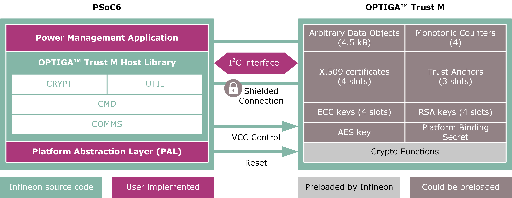

# OPTIGA™ Trust M: Power management

This example uses an OPTIGA™ Trust M V3 security solution along with a PSoC&trade; 6 MCU to execute example code to demonstrate the power management routines of the secure element. This example outputs the result and the time taken to perform the operations in a UART terminal.

In a nutshell, the hibernation feature on the OPTIGA™ Trust M means that a host MCU can power down the security solution by removing the power from it, but under certain conditions, the latter can hold all internal temporarily allocated information despite being disconnected from the power line.

The interconnection setup looks like the following:

**Figure 1. Connection between PSoC™ 6 host MCU and OPTIGA™ Trust M**



[View this README on GitHub.](https://github.com/Infineon/mtb-example-optiga-power-management)

[Provide feedback on this code example.](https://cypress.co1.qualtrics.com/jfe/form/SV_1NTns53sK2yiljn?Q_EED=eyJVbmlxdWUgRG9jIElkIjoiQ0UyMzM3MzQiLCJTcGVjIE51bWJlciI6IjAwMi0zMzczNCIsIkRvYyBUaXRsZSI6Ik9QVElHQeKEoiBUcnVzdCBNOiBQb3dlciBtYW5hZ2VtZW50IiwicmlkIjoieXVzaGV2IiwiRG9jIHZlcnNpb24iOiIxLjAuMCIsIkRvYyBMYW5ndWFnZSI6IkVuZ2xpc2giLCJEb2MgRGl2aXNpb24iOiJOL0EiLCJEb2MgQlUiOiJOL0EiLCJEb2MgRmFtaWx5IjoiTi9BIn0=)


## Requirements

- [ModusToolbox™ software](https://www.cypress.com/products/modustoolbox) v2.4
- Board support package (BSP) minimum required version: 2.0.0
- Programming language: C
- Associated parts:
  - All [PSoC™ 6 MCU](http://www.cypress.com/PSoC6) parts
  - [OPTIGA™ Trust M V3](http://www.infineon.com/optiga-trust-m)


## Supported toolchains (make variable 'TOOLCHAIN')

- GNU Arm® embedded compiler v9.3.1 (`GCC_ARM`) - Default value of `TOOLCHAIN`
- Arm&reg; compiler v6.11 (`ARM`)
- IAR C/C++ compiler v8.42.2 (`IAR`)


## Supported kits (make variable 'TARGET')

- [PSoC&trade; 62S2 evaluation kit](https://www.infineon.com/CY8CEVAL-062S2) (`CY8CEVAL-062S2`)
- [PSoC&trade; 62S2 evaluation kit with the Sterling-LWB5+ M.2 radio module](https://www.infineon.com/cms/en/product/evaluation-boards/cy8ceval-062s2/) (`CY8CEVAL-062S2-LAI-4373M2`)
- [PSoC&trade; 62S2 evaluation kit with the CYW943439M2IPA1 radio module](https://www.infineon.com/cms/en/product/evaluation-boards/cy8ceval-062s2/) (`CY8CEVAL-062S2-CYW943439M2IPA1`)


## Hardware setup

This example uses the board's default configuration. See the kit user guide to ensure that the board is configured correctly.


## Software setup

Install a terminal emulator if you don't have one. Instructions in this document use [Tera Term](https://ttssh2.osdn.jp/index.html.en).

## Using the code example

Create the project and open it using one of the following:

<details><summary><b>In Eclipse IDE for ModusToolbox&trade; software</b></summary>

1. Click the **New application** link in the **quick panel** (or, use **File** > **New** > **ModusToolbox&trade; Application**). This launches the [Project Creator](https://www.cypress.com/ModusToolboxProjectCreator) tool.

2. Pick a kit supported by the code example from the list shown in the **Project creator - Choose board support package (BSP)** dialog.

   When you select a supported kit, the example is reconfigured automatically to work with the kit. To work with a different supported kit later, use the [Library Manager](https://www.cypress.com/ModusToolboxLibraryManager) to choose the BSP for the supported kit. You can use the library manager to select or update the BSP and firmware libraries used in this application. To access the library manager, click the link from the **Quick Panel**.

   You can also just start the application creation process again and select a different kit.

   If you want to use the application for a kit not listed here, you may need to update the source files. If the kit does not have the required resources, the application may not work.

3. In the **Project Creator - Select Application** dialog, choose the example by enabling the checkbox.

4. (Optional) Change the suggested **New Application Name**.

5. The **Application(s) Root Path** defaults to the Eclipse workspace which is usually the desired location for the application. If you want to store the application in a different location, you can change the *Application(s) root path* value. Applications that share libraries should be in the same root path.

6. Click **Create** to complete the application creation process.

For more details, see the [Eclipse IDE for ModusToolbox&trade; software user guide](https://www.cypress.com/MTBEclipseIDEUserGuide) (locally available at *{ModusToolbox&trade; software install directory}/ide_{version}/docs/mt_ide_user_guide.pdf*).

</details>

<details><summary><b>In command-line interface (CLI)</b></summary>

ModusToolbox&trade; software provides the project creator as both a GUI tool and the command line tool, "project-creator-cli". The CLI tool can be used to create applications from a CLI terminal or from within batch files or shell scripts. This tool is available in the *{ModusToolbox&trade; software install directory}/tools_{version}/project-creator/* directory.

Use a CLI terminal to invoke the "project-creator-cli" tool. On Windows, use the command line "modus-shell" program provided in the ModusToolbox&trade; software installation instead of a standard Windows command-line application. This shell provides access to all ModusToolbox&trade; software tools. You can access it by typing `modus-shell` in the search box in the Windows menu. In Linux and macOS, you can use any terminal application.

This tool has the following arguments:

Argument | Description | Required/optional
---------|-------------|-----------
`--board-id` | Defined in the `<id>` field of the [BSP](https://github.com/Infineon?q=bsp-manifest&type=&language=&sort=) manifest | Required
`--app-id`   | Defined in the `<id>` field of the [CE](https://github.com/Infineon?q=ce-manifest&type=&language=&sort=) manifest | Required
`--target-dir`| Specify the directory in which the application is to be created if you prefer not to use the default current working directory | Optional
`--user-app-name`| Specify the name of the application if you prefer to have a name other than the example's default name | Optional

<br>

The following example will clone the "[OPTIGA™ Trust M: Power management](https://github.com/Infineon/mtb-example-optiga-power-management)" application with the desired name "MyOPTIGAPowerManagement" configured for the *CY8CEVAL-062S2* BSP into the specified working directory, *C:/mtb_projects*:

   ```
   project-creator-cli --board-id CY8CEVAL-062S2 --app-id mtb-example-optiga-power-management --user-app-name MyOPTIGAPowerManagement --target-dir "C:/mtb_projects"
   ```

**Note:** The project-creator-cli tool uses the `git clone` and `make getlibs` commands to fetch the repository and import the required libraries. For details, see the "Project creator tools" section of the [ModusToolbox&trade; software user guide](https://www.cypress.com/ModusToolboxUserGuide) (locally available at *{ModusToolbox&trade; software install directory}/docs_{version}/mtb_user_guide.pdf*).

</details>

<details><summary><b>In third-party IDEs</b></summary>

Use one of the following options:

- **Use the standalone [Project Creator](https://www.cypress.com/ModusToolboxProjectCreator) tool:**

   1. Launch the project creator from the Windows Start menu or from *{ModusToolbox&trade; software install directory}/tools_{version}/project-creator/project-creator.exe*.

   2. In the initial **Choose board support package** screen, select the BSP, and click **Next**.

   3. In the **Select application** screen, select the appropriate IDE from the **Target IDE** drop-down menu.

   4. Click **Create** and follow the instructions printed in the bottom pane to import or open the exported project in the respective IDE.

<br>

- **Use command-line interface (CLI):**

   1. Follow the instructions from the **In command-line interface (CLI)** section to create the application, and then import the libraries using the `make getlibs` command.

   2. Export the application to a supported IDE using the `make <ide>` command.

   3. Follow the instructions displayed in the terminal to create or import the application as an IDE project.

For a list of supported IDEs and more details, see the "Exporting to IDEs" section of the [ModusToolbox&trade; software user guide](https://www.cypress.com/ModusToolboxUserGuide) (locally available at *{ModusToolbox&trade; software install directory}/docs_{version}/mtb_user_guide.pdf*).

</details>


## Operation

1. Connect the board to your PC using the provided USB cable through the KitProg3 USB connector.

2. Open a terminal program and select the KitProg3 COM port. Set the serial port parameters to 8N1 and 115200 baud.

3. Program the board using one of the following:

   <details><summary><b>Using Eclipse IDE for ModusToolbox&trade; software</b></summary>

      1. Select the application project in the project explorer.

      2. In the **quick panel**, scroll down, and click **\<Application name> Program (KitProg3_MiniProg4)**.
   </details>

   <details><summary><b>Using CLI</b></summary>

     From the terminal, execute the `make program` command to build and program the application using the default toolchain to the default target. The default toolchain and target are specified in the application's Makefile but you can override those values manually:
      ```
      make program TARGET=<BSP> TOOLCHAIN=<toolchain>
      ```

      Example:
      ```
      make program TARGET=CY8CEVAL-062S2 TOOLCHAIN=GCC_ARM
      ```

4. After programming, the application starts automatically. Confirm that the following text is displayed on the UART terminal.

   **Figure 2. Terminal output on program startup**

   


## Debugging

You can debug the example to step through the code. In the IDE, use the **\<Application name> Debug (KitProg3_MiniProg4)** configuration in the **Quick Panel**. For more details, see the "Program and debug" section in the [Eclipse IDE for ModusToolbox&trade; software user guide](https://www.cypress.com/MTBEclipseIDEUserGuide).

**Note:** **(Only while debugging)** On the CM4 CPU, some code in `main()` may execute before the debugger halts at the beginning of `main()`. This means that some code executes twice - once before the debugger stops execution, and again after the debugger resets the program counter to the beginning of `main()`. See [KBA231071](https://community.cypress.com/docs/DOC-21143) to learn about this and for the workaround.


## Design and implementation

The code example demonstrates one of scenarios to prepare and make use of the hibernation feature of the OPTIGA&trade; Trust M security solution. In a nutshell, the host MCU can control the enablement of the hibernation feature on the OPTIGA&trade; device by sending a corresponding command to the chip over the I2C channel.

**Important:** To use all features provided by this example, your board should be able to control the power switch of the OPTIGA™ Trust M device. See [Resources and settings](#resources-and-settings).

Do the following:

1. Open the application on the security solution as usual.

2. Generate an ECC key pair and store the result in a session object.

   The session object is located in a volatile memory and thus is erased each time the chip is powered off.

3. To enter hibernate mode, the security monitor counter should be 0. Note that the previous step performed a crypto operation that caused the security monitor counter to increment to 1.

   **Note:** To learn more about the security monitor and its operation, see [this Wiki page](https://github.com/Infineon/optiga-trust-m/wiki/Security-Monitor).

4. Enter hibernate mode and save the communication context on both sides (host MCU and security solution) by closing the application with the hibernate flag set to '1'.

5. Open the application once again with the hibernate flag set to '1'. This restores the old communication context and all temporally stored data on the security solution.

6. Generate an ECDSA signature using the private key from the session object. In normal conditions with no hibernate option used, that would be not possible, because the session object would be empty.

7. Verify the signature using the public key saved in Step 2.

8. Close the application without transitioning to hibernate mode.

Hibernate mode plays a very important role if a shielded communication is used (protected I2C connection). Both the host MCU and the security solution maintain a session context that contains several aspects of the communication. This information is temporally stored on the security solution (the host side can theoretically store it) and is by default erased after every power cycle.

If the hibernate feature is not used, that session context must be established every single time. This leads to a platform-binding secret usage, thus triggering a SEC counter (security monitor counter). If this is triggered too often, eventually every system power-up routine will take a lot of time. The latter would be required because to use the OPTIGA&trade; Trust M device, the host MCU must wait until the SEC counter reaches a value when a new security relevant operation can be performed.


### Power states of OPTIGA&trade; Trust M

OPTIGA&trade; Trust M automatically enters a low-power mode after a configurable delay. This isn't hibernation mode, which can be entered only on demand by sending a corresponding command from the host MCU to the security solution. Once it has entered sleep mode, the OPTIGA&trade; solution resumes the normal operation as soon as its address is detected on the I2C bus. If no command is sent to the chip, it behaves as show in Figure 3.

1. As soon as the OPTIGA&trade; device is idle, it starts to count down a "delay to sleep" time (t<sub>sdy</sub>).

2. When this time elapses, the device enters a "go to sleep" procedure.

3. The "go to sleep" procedure waits until all idle tasks are completed (e.g., counting down the SEC counter). If all idle tasks are completed and no command is pending, the OPTIGA&trade; device enters sleep mode.

**Figure 3. Go-to-sleep diagram**


### Resources and settings

OPTIGA™ Trust M pins  | Assigned GPIOs by default | Notes
--------------------- | ------------------------- | ------
I2C SDA (I/O) | CYBSP_TRUSTM_I2C_SDA | Any GPIO connected to the I2C SDA line can be used.
I2C SCL (Clock) | CYBSP_TRUSTM_I2C_SCL | Any GPIO connected to the I2C SDA line can be used.
RST (Reset) | CYBSP_TRUSTM_RST | An optional control pin if defined in [*optiga_lib_config_mtb.h*](source/optiga_lib_config_mtb.h)
VDD (Power control) | (Optional) CYBSP_TRUSTM_VDD | An optional control pin if defined in [*optiga_lib_config_mtb.h*](source/optiga_lib_config_mtb.h)

<br>

[*optiga_lib_config_mtb.h*](source/optiga_lib_config_mtb.h) macros  | Meaning  | Default value
 ---------------- | ------------- | ---------
`OPTIGA_CRYPT_XXXX` | Controls whether to enable/disable selected crypto support on the host library side | All enabled
`OPTIGA_COMMS_SHIELDED_CONNECTION` and `OPTIGA_COMMS_DEFAULT_PROTECTION_LEVEL` | Together define whether to use and the extent of use of the shielded connection (encrypted and integrity-protected I2C communication) | Defined `OPTIGA_COMMS_SHIELDED_CONNECTION` | If this and the `OPTIGA_COMMS_DEFAULT_PROTECTION_LEVEL` macro are set to `OPTIGA_COMMS_NO_PROTECTION`, you must decide the API to protect and the extent of protection right before that API is called by calling `OPTIGA_CRYPT_SET_COMMS_PROTECTION_LEVEL()` and `OPTIGA_CRYPT_SET_COMMS_PROTOCOL_VERSION()` | `OPTIGA_COMMS_SHIELDED_CONNECTION`: Defined `OPTIGA_COMMS_DEFAULT_PROTECTION_LEVEL`: Set to `OPTIGA_COMMS_NO_PROTECTION`
`OPTIGA_COMMS_DEFAULT_RESET_TYPE` | The reset type if VDD or RST pin is defined. Choose 1 or 2 depending on the combination used. VDD can be used in certain cases as a reset line, but it is recommended to use them separately. | 2
`OPTIGA_CMD_MAX_REGISTRATIONS` | Controls the number of `crypt`/`util` registrations allowed. In a very basic scenario, this can be reduced to 2 (one registration each for `crypt` and `util`). | 6
`OPTIGA_MAX_COMMS_BUFFER_SIZE` | Maximum buffer size that the command layer should be able to store intermediately | 0x615
`OPTIGA_LIB_ENABLE_LOGGING` | Controls whether logging can be enabled in general | Defined
`OPTIGA_LIB_ENABLE_UTIL_LOGGING` | If defined together with `OPTIGA_LIB_ENABLE_LOGGING`, outputs messages relevant to the `util` API | Undefined
`OPTIGA_LIB_ENABLE_CRYPT_LOGGING` | If defined together with `OPTIGA_LIB_ENABLE_LOGGING`, outputs messages relevant to the `crypt` API  | Undefined
`OPTIGA_LIB_ENABLE_CMD_LOGGING` | If defined together with `OPTIGA_LIB_ENABLE_LOGGING`, outputs the application protocol data unit (APDU) sent to the OPTIGA&trade; Trust M external interface (See the solution reference manual) | Undefined
`OPTIGA_LIB_ENABLE_COMMS_LOGGING` | If defined together with `OPTIGA_LIB_ENABLE_LOGGING`, prints out I2C frames | Undefined

<br>

## Related resources

Resources | Links
----------|------
Application notes |[AN228571](https://www.cypress.com/AN228571) – Getting started with PSoC&trade; 6 MCU on ModusToolbox&trade; software <br> [AN215656](https://www.cypress.com/AN215656) – PSoC&trade; 6 MCU: Dual-CPU system design
Code examples on GitHub| [Using ModusToolbox&trade; software](https://github.com/infineon/Code-Examples-for-ModusToolbox-Software)
Device documentation | [PSoC&trade; 6 MCU datasheets](https://www.cypress.com/search/all?f[0]=meta_type%3Atechnical_documents&f[1]=resource_meta_type%3A575&f[2]=field_related_products%3A114026) <br> [PSoC&trade; 6 technical reference manuals](https://www.cypress.com/search/all/PSoC%206%20Technical%20Reference%20Manual?f[0]=meta_type%3Atechnical_documents&f[1]=resource_meta_type%3A583) <br> [OPTIGA&trade; Trust M datasheet](https://www.infineon.com/cms/en/product/security-smart-card-solutions/optiga-embedded-security-solutions/optiga-trust/optiga-trust-m-sls32aia/#!?fileId=5546d4626c1f3dc3016c853c271a7e4a)
Development kits | Select your kits from the [Evaluation Board Finder](https://www.infineon.com/cms/en/design-support/finder-selection-tools/product-finder/evaluation-board) page.
Libraries on GitHub  | [mtb-pdl-cat1](https://github.com/infineon/mtb-pdl-cat1) – PSoC&trade; 6 peripheral driver library (PDL)  <br> [mtb-hal-cat1](https://github.com/infineon/mtb-hal-cat1) – Hardware abstraction layer (HAL) library <br> [retarget-io](https://github.com/infineon/retarget-io) – Utility library to retarget STDIO messages to a UART port
Middleware on GitHub  | [optiga-trust-m](https://github.com/infineon/optiga-trust-m) – OPTIGA™ Trust M library and documents <br> [capsense](https://github.com/infineon/capsense) – CAPSENSE&trade; library and documents <br> [psoc6-middleware](https://github.com/Infineon/modustoolbox-software#psoc-6-middleware-libraries) – Links to all PSoC&trade; 6 MCU middleware
Tools  | [Eclipse IDE for ModusToolbox&trade; software](https://www.cypress.com/modustoolbox) – ModusToolbox&trade; software is a collection of easy-to-use software and tools enabling rapid development with Infineon MCUs, covering applications from embedded sense and control to wireless and cloud-connected systems using AIROC&trade; Wi-Fi and Bluetooth® connectivity devices.


## Other resources

Infineon provides a wealth of data at www.infineon.com to help you select the right device, and quickly and effectively integrate it into your design.

For PSoC&trade; 6 MCU devices, see [How to design with PSoC&trade; 6 MCU - KBA223067](https://community.infineon.com/t5/Knowledge-Base-Articles/How-to-Design-with-PSoC-6-MCU-KBA223067/ta-p/248857) in the Infineon community.


## Document history

Document title: *CE233734* – *OPTIGA&trade; Trust M: Power management*

| Version | Description of change |
| ------- | --------------------- |
| 1.0.0   | New code example      |
------

All other trademarks or registered trademarks referenced herein are the property of their respective owners.

------------

© Cypress Semiconductor Corporation, 2022. This document is the property of Cypress Semiconductor Corporation, an Infineon Technologies company, and its affiliates ("Cypress").  This document, including any software or firmware included or referenced in this document ("Software"), is owned by Cypress under the intellectual property laws and treaties of the United States and other countries worldwide.  Cypress reserves all rights under such laws and treaties and does not, except as specifically stated in this paragraph, grant any license under its patents, copyrights, trademarks, or other intellectual property rights.  If the Software is not accompanied by a license agreement and you do not otherwise have a written agreement with Cypress governing the use of the Software, then Cypress hereby grants you a personal, non-exclusive, nontransferable license (without the right to sublicense) (1) under its copyright rights in the Software (a) for Software provided in source code form, to modify and reproduce the Software solely for use with Cypress hardware products, only internally within your organization, and (b) to distribute the Software in binary code form externally to end users (either directly or indirectly through resellers and distributors), solely for use on Cypress hardware product units, and (2) under those claims of Cypress’s patents that are infringed by the Software (as provided by Cypress, unmodified) to make, use, distribute, and import the Software solely for use with Cypress hardware products.  Any other use, reproduction, modification, translation, or compilation of the Software is prohibited. <br>
TO THE EXTENT PERMITTED BY APPLICABLE LAW, CYPRESS MAKES NO WARRANTY OF ANY KIND, EXPRESS OR IMPLIED, WITH REGARD TO THIS DOCUMENT OR ANY SOFTWARE OR ACCOMPANYING HARDWARE, INCLUDING, BUT NOT LIMITED TO, THE IMPLIED WARRANTIES OF MERCHANTABILITY AND FITNESS FOR A PARTICULAR PURPOSE. No computing device can be absolutely secure. Therefore, despite security measures implemented in Cypress hardware or software products, Cypress shall have no liability arising out of any security breach, such as unauthorized access to or use of a Cypress product. CYPRESS DOES NOT REPRESENT, WARRANT, OR GUARANTEE THAT CYPRESS PRODUCTS, OR SYSTEMS CREATED USING CYPRESS PRODUCTS, WILL BE FREE FROM CORRUPTION, ATTACK, VIRUSES, INTERFERENCE, HACKING, DATA LOSS OR THEFT, OR OTHER SECURITY INTRUSION (collectively, "Security Breach"). Cypress disclaims any liability relating to any Security Breach, and you shall and hereby do release Cypress from any claim, damage, or other liability arising from any Security Breach. In addition, the products described in these materials may contain design defects or errors known as errata which may cause the product to deviate from published specifications. To the extent permitted by applicable law, Cypress reserves the right to make changes to this document without further notice. Cypress does not assume any liability arising out of the application or use of any product or circuit described in this document. Any information provided in this document, including any sample design information or programming code, is provided only for reference purposes. It is the responsibility of the user of this document to properly design, program, and test the functionality and safety of any application made of this information and any resulting product. "High-Risk Device" means any device or system whose failure could cause personal injury, death, or property damage. Examples of High-Risk Devices are weapons, nuclear installations, surgical implants, and other medical devices. "Critical Component" means any component of a High-Risk Device whose failure to perform can be reasonably expected to cause, directly or indirectly, the failure of the High-Risk Device, or to affect its safety or effectiveness. Cypress is not liable, in whole or in part, and you shall and hereby do release Cypress from any claim, damage, or other liability arising from any use of a Cypress product as a Critical Component in a High-Risk Device. You shall indemnify and hold Cypress, its directors, officers, employees, agents, affiliates, distributors, and assigns harmless from and against all claims, costs, damages, and expenses, arising out of any claim, including claims for product liability, personal injury or death, or property damage arising from any use of a Cypress product as a Critical Component in a High-Risk Device. Cypress products are not intended or authorized for use as a Critical Component in any High-Risk Device except to the limited extent that (i) Cypress's published data sheet for the product explicitly states Cypress has qualified the product for use in a specific High-Risk Device, or (ii) Cypress has given you advance written authorization to use the product as a Critical Component in the specific High-Risk Device and you have signed a separate indemnification agreement.<br />
Cypress, the Cypress logo, Spansion, the Spansion logo, and combinations thereof, WICED, PSoC, CapSense, EZ-USB, F-RAM, and Traveo are trademarks or registered trademarks of Cypress in the United States and other countries. For a more complete list of Cypress trademarks, visit cypress.com. Other names and brands may be claimed as property of their respective owners.
